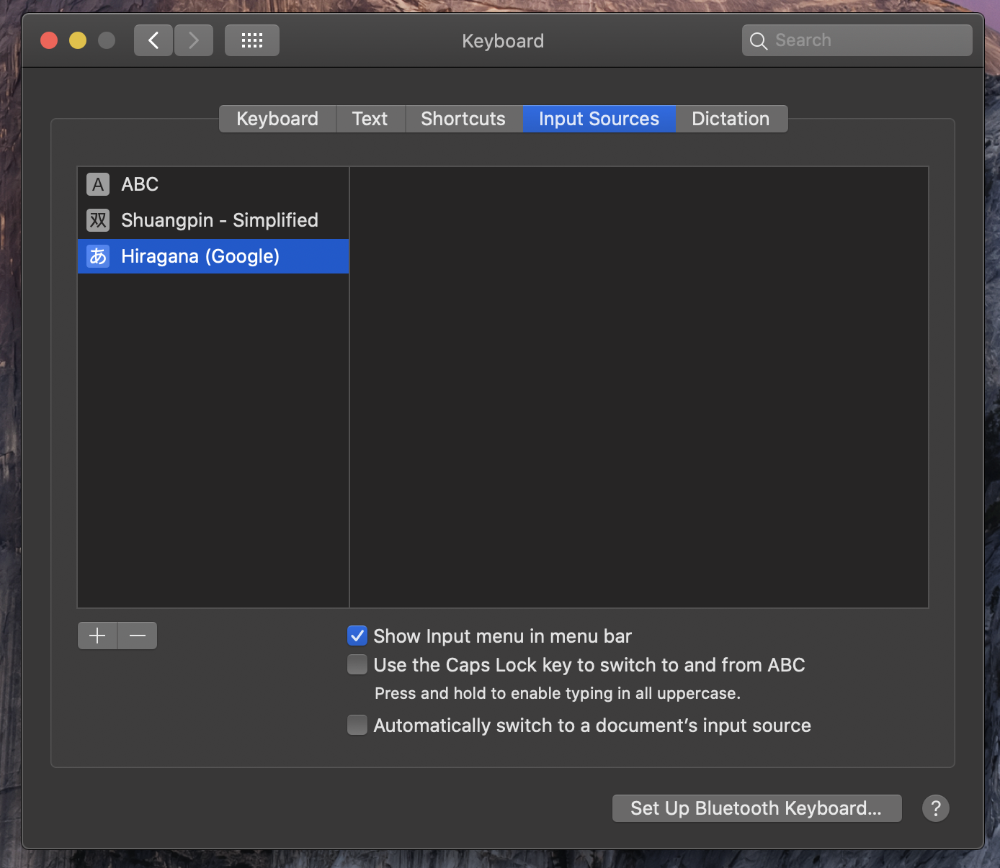
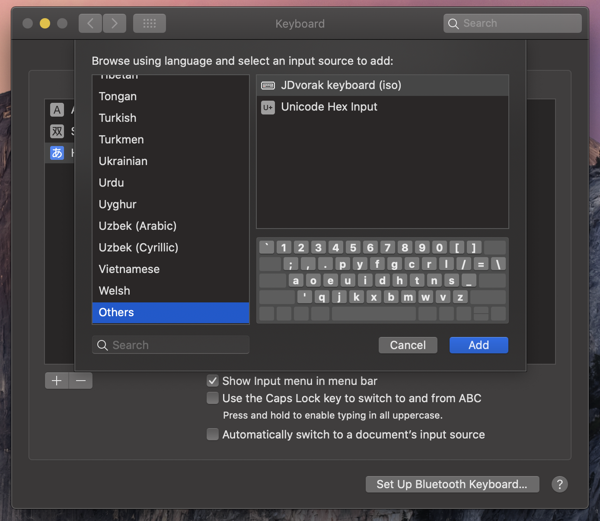
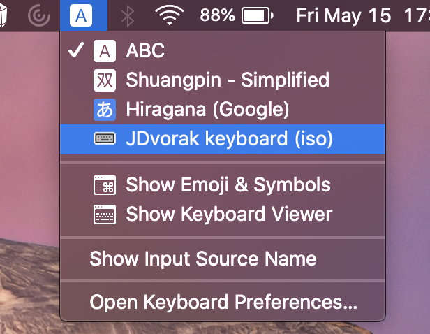
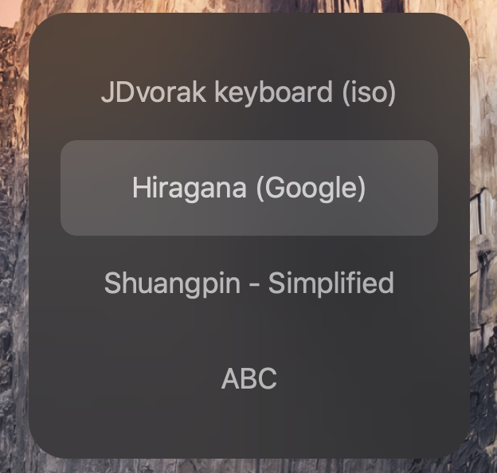

[](https://circleci.com/gh/andrewjunyoung/symboard) 
[](https://pypi.org/project/symboard/0.4.0/) 
[](https://circleci.com/gh/andrewjunyoung/symboard)

# Ṡymβoarð (Symboard)

<!-- vim-markdown-toc GFM -->

* [About](#about)
* [Vision](#vision)
* [Installation](#installation)
  * [Pip](#pip)
* [Basic usage](#basic-usage)
  * [Creating a keylayout](#creating-a-keylayout)
  * [Installing a keyboard (macOS)](#installing-a-keyboard-macos)
* [macOS](#macos)

<!-- vim-markdown-toc -->

# About

Symboard is a versatile text-based keyboard creator. Symboard takes a
description of the keyboard you want (written in [yaml](https://yaml.org/)), and
have this keyboard automatically generated and installed onto your computer.

Symboard is *human readable*, *easy to edit*, and *easy to extend*.

What does all that mean?

When we a specification is *human readable*, we mean that you can describe your
dream keyboard in a logical format close to plain English.

When we say it's *easy to edit*, we mean that you can change it with little time
or difficulty, even for big bulky changes like supporting a whole new language.

When we say it's *easy to extend*, we mean that if Symboard doesn't have a
feature built in, it won't take long to add it yourself.

# Vision

For most languages, computer keyboards are remarkably inexpressive, and even 100
years after their creation, are hard to use. As a multilingual person, you may
find yourself flipping between 2, 3, or even waay more keyboards. It's a pain.

Even for speakers of just one language, as soon as you start trying to type
math, or emoji, or even just make jokes with strikethrough text, your keyboard
just doesn't cut it.

I want symboard to be *the* standard keyboard editor. Period. Whatever keyboard
you use, whether that's QWERTY, AZERTY, Dvorak, or Russian, you should be able
to type any symbol you want on your keyboard. And it should be something you
don't give any thought to.

I want symboard to have a huge library of plugins for anything a user could
want: for making that english keyboard able to type that math symbol you always
need; for making that type spanish keyboard type french too; for making your
linguistics paper muuuch easier to write.

And, I want users to just tick boxes about what features they need their
keyboard to have. Forget having a huge list of keyboards to choose from when you
start your computer. Pick whatever keyboard layout you want, and make it
_support whatever symbols you want it to type_, without making it hard to use.

The days of keyboard lists in OSes are the past: pick a layout, pick the
symbols you need. Change your mind later if you want to.

<!-- TODO: Click to see slides -->

# Installation

<!-- TODO: Click to read the full documentation -->

## Pip

Run the following script in a terminal of your choice:

```
pip install symboard
```

# Basic usage

<!-- TODO: Click to read the full documentation --> 

## Creating a keylayout

1. Create a yaml spec and save it somewhere on your computer.

1. Run
```
symboard/main.py <path_to_your_yaml_spec> <output_path>
```
The keylayout file will be written to the location at <output\_path>, as you
specify.

## Installing a keyboard (macOS)

# macOS

1. Copy your keylayout file into the keylayouts directory. To do this, run the
following code inside the Symboard project directory:
```
source ./symboard/scripts/install <path_to_your_keylayout>
```

1. Open System Preferences and navigate to «keyboard» > «input sources». Click
   on the + sign in the bottom right.



1. Search for your keyboard layout. It's most likely to appear under «others»,
   at the bottom of the list.



1. Click «Add».

1. Your keyboard is now available to use! To switch to it, either click on the
   keyboard icon in the menu bar, or flip through your keyboards to find it.




